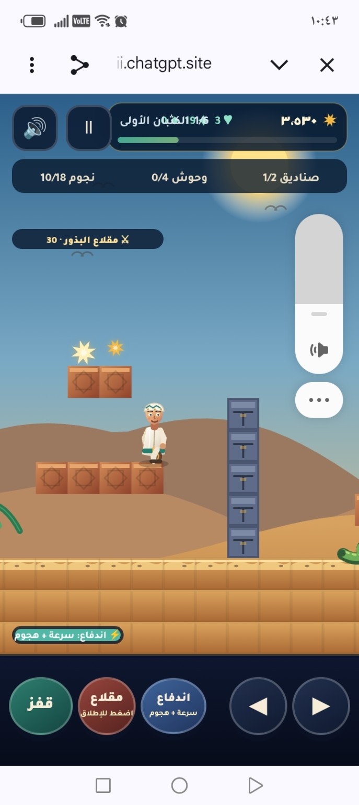

# سعيد ناصر — رحلة الواحة  
# Saeed Nasser — Oasis Journey

🎮 **[العب الآن في المتصفح | Play now](https://nasseralsawaii.github.io/saeed-oasis-game/)**

لعبة منصات عربية مفتوحة المصدر مستوحاة من البيئات العُمانية، تعمل مباشرة في المتصفح على الهاتف والحاسوب.

An open-source Arabic browser platformer inspired by Omani environments, designed for mobile and desktop play.



## لماذا هذا المشروع؟ | Why this project?

يقدّم المشروع محتوى تفاعليًا عربيًا أصيلًا، ويعرض مثالًا خفيفًا وقابلًا لإعادة الاستخدام لبناء ألعاب HTML5 Canvas تدعم العربية واتجاه الكتابة من اليمين إلى اليسار.

The project expands Arabic-first interactive content and offers educators and beginner developers a lightweight, reusable example of an RTL HTML5 Canvas game.

## المزايا | Features

- ثلاث مراحل مستوحاة من البيئة العُمانية.
- مهام وصناديق ومفاتيح ونجوم وأعداء ونظام نقاط متدرج.
- قفز وإطلاق واندفاع مع مؤثرات صوتية وحركية.
- تحكم بلوحة المفاتيح وأزرار لمس متجاوبة.
- حفظ أفضل نتيجة محليًا في المتصفح.
- بنية خفيفة دون خادم خلفي أو إطار عمل.
- Three Omani-inspired environments with missions and hazards.
- Responsive keyboard and touch controls.
- Local best-score persistence and offline-friendly static architecture.

## التشغيل | Run locally

لا يحتاج المشروع إلى تثبيت. نزّل الملفات وافتح `index.html` في متصفح حديث، أو شغّل خادمًا محليًا بسيطًا:

```bash
python3 -m http.server 8000
```

ثم افتح `http://localhost:8000`.

No build step is required. Open `index.html` directly or serve the repository with any static web server.

## التحكم | Controls

| الإجراء | Keyboard |
| --- | --- |
| الحركة | Arrow keys or A / D |
| القفز | Space |
| الإطلاق | F |
| الاندفاع | Shift |
| الإيقاف المؤقت | Pause button |

تظهر أزرار اللمس تلقائيًا على الهواتف والأجهزة اللوحية.

## الصيانة والمساهمة | Maintenance

- [خريطة التطوير](ROADMAP.md)
- [دليل المساهمة](CONTRIBUTING.md)
- [سجل التغييرات](CHANGELOG.md)
- [سياسة الأمان](SECURITY.md)

تُراجع البلاغات وطلبات التحسين عبر GitHub Issues. نرحب بالمساهمات التي تحسن الوصول، والأداء، ودعم العربية، والقيمة التعليمية.

Issues and pull requests are welcome, especially for accessibility, performance, Arabic localization, testing, and educational missions.

## التقنيات | Technology

- HTML5 Canvas
- CSS3
- Vanilla JavaScript
- Arabic RTL responsive design
- GitHub Actions for validation and Pages deployment

## المؤلف والمشرف الرئيسي | Maintainer

ناصر بن راشد الصواعي — [@nasseralsawaii](https://github.com/nasseralsawaii)

## الرخصة | License

مرخّص بموجب [MIT License](LICENSE).
